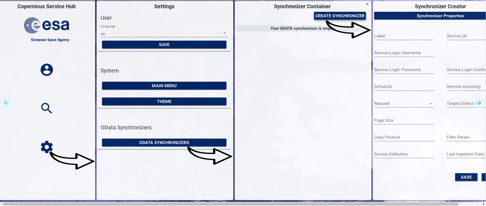
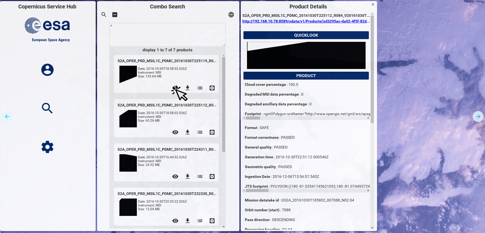
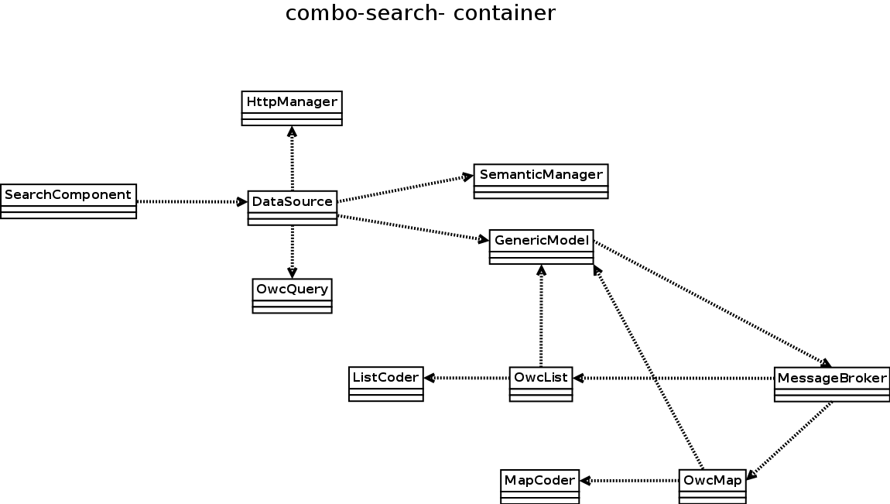
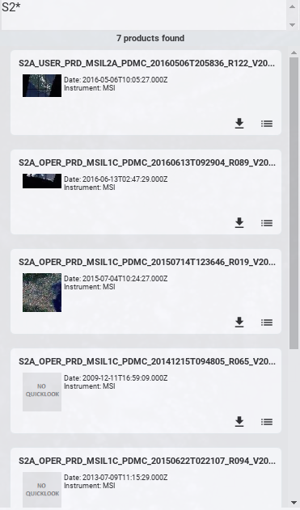
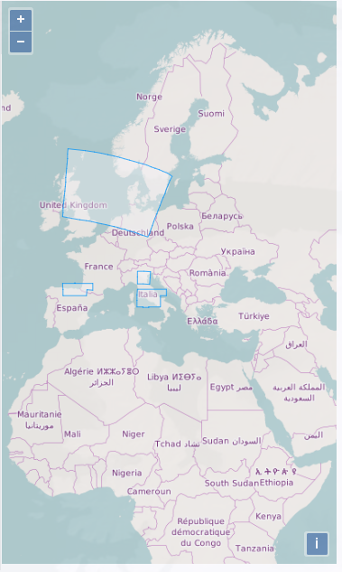
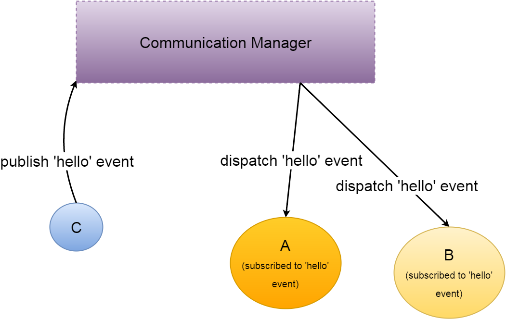
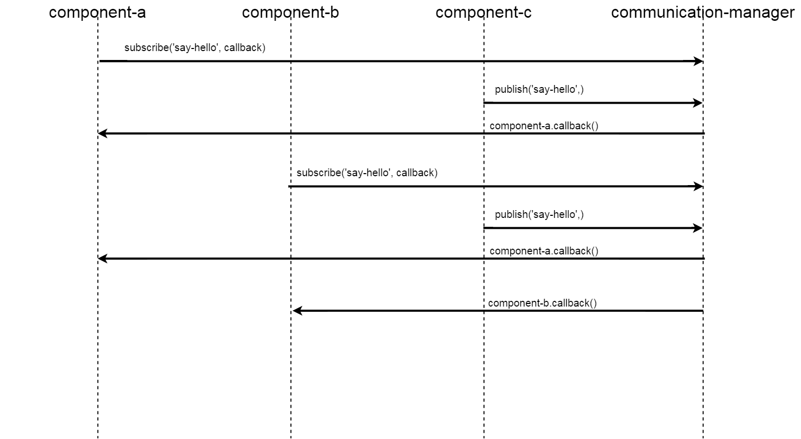
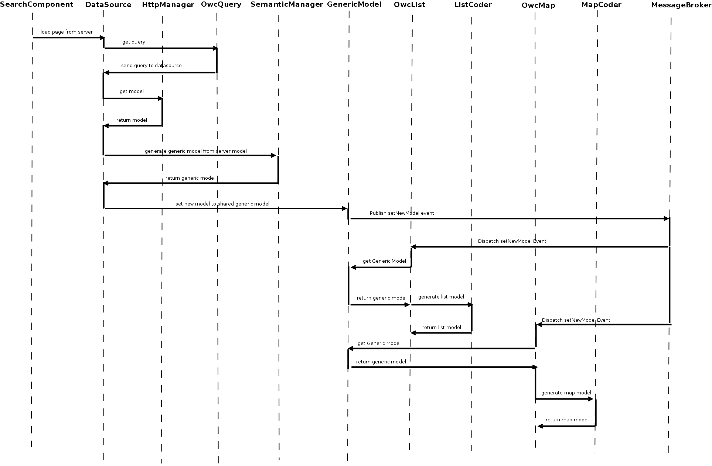

# USER GUIDES

## Preface
This guide is oriented at anyone who is interested on Space Data Dissemination and wants to use Open Web Components (OWC) software, a configurable, user friendly, extensible Graphical User Interface for the SentinelDataHub/DataHubSystem, based on Web Components (Polymer).

## Prerequisites

To understand every part of the following guide it is required at least some `HTML`, `CSS` and `Javascript` programming experience.
Basic knowledge of HTML5, CSS and Javascript principles are enough to run and configure the ESA Scientific HUB Open Web Components.
This means that these guidelines are intended for intermediate web developers.

Before we dive in, a brief description of Standards and technologies involved is reported in next paragraphs.
### Web Components

`Web Components` are a set of standards beign added to the HTML and DOM specification, by the World Wide Web Consortium (W3C). Web Components main innovation is the possibility to use an Object Oriented approach in Web application development.
The main features of Web Components standards are:
  - Custom Elements, a specification describing the method for enabling the author to define and use new types of DOM elements in a document.
  - Shadow DOM, a specification based on encapsulation and hiding the innards of a custom element inside a nested document, avoiding overriding of JavaScript methods and CSS styles.
  - HTML Imports, a specification which allows to include and reuse HTML documents, considered as external resources, in other HTML documents.
  - HTML Template, a specification which enables to store HTML data inside an HTML document, by means of &lt;template&gt; tag. The &lt;template&gt; element is used to declare fragments of HTML that can be cloned and inserted in the document by script. The content of a &lt;template&gt; element is parsed without interpreting it.


### Polymer

`Polymer` is an open-source library for creating web applications using web components, following Material Design principles.
Polymer library is designed to make it easier and faster for developers to create great, reusable components for the modern web.
Polymer is built on top of the web components standards and it helps developers in building their own custom elements.

Polymer library provides a declarative syntax that makes it simpler to define custom elements. It adds features like templating, two-way data binding and property observation to help building powerful, reusable elements with less code.

More information about Polymer library can be found at: https://www.polymer-project.org/1.0/docs/start/what-is-polymer.html

### Bower
`bower` is package manager of web (html/css/js) dependencies for client side (browser). It simplifies developers' job downloading and managing all external libraries used by a web application. It's enough to include in your application a file, called bower.json, with the list of dependencies and the version to use.

### Node.js
`Node.js` is is an open-source, cross-platform JavaScript runtime environment for developing tools and application. Node.js javascript interpreter is Google's V8. In the context of OWC, Node.js is required as Bower dependency.

### Npm (Node Package Manager)

`npm` is the Node.js package manager, automatically included when Node.js is installed. npm manages installation of packages that are local dependencies of a particular project, resolving also, in one command, all the dependencies of a project.

### Gulp
`Gulp` helps automation of time-consuming tasks in development workflow. It is a Node.js task manager used mainly for:
- Minification and concatenation of Javascript and CSS files
- CSS and Javascript preprocessing and validation
- Image optimization
- Unit testing

The philosophy of gulp is *code over configurations*


### OData
`OData (Open Data Protocol)`  is a standard that defines a set of best practices for building and consuming RESTful APIs. OData RESTful APIs are easy to consume. The OData metadata, a machine-readable description of the data model of the APIs, enables the creation of powerful generic client proxies and tools.

## Chapter 1: Open Web Components
### Introduction to Open Web Components
The **Open Web Components** (**OWC**) is a client side software following the Single Page Application approach, for space data dissemination. The Software is based on Web Components Standard with Polymer v1.0 implementation.

These are the basic principles to be followed for **OWC** development:
- Modularity
- Extensibility
- Customization
- Open Source

The fulfillment of these principles involves the ability to install the same OWC software version on different sites, configuring OWC in order to:
- include different functionalities on different sites
- combine the same functionalities in different ways on different sites.
The following figure is a representation of this concept.


#### Modularity  
Since **OWC** architecture follows Object Oriented Programming, each component has to be designed and implemented as an independent module. This ensures the possibility to use and integrate easily a module in the main application, since each component is selfstanding and contains everything necessary to execute the desired functionalities.

#### Extensibility
The **OWC** application is extensible, because it-s possible to add new functionalities (i.e. new components) without any impact on existing code. One of the most powerful innovation of Web Components standard is the chance of importing components located everywhere in the web. This implies that is possible to extend the application with:
- internal components, i.e. components located within OWC application
- external components, i.e. components deployed outside OWC application and reachable through an HTTP URL


The extensibility principle is fully granted following the best practices of this guide for new components development.

#### Customization
Another important aspect of **OWC** is Customization, implemented in terms of:
- menu items (i.e. functionalities) displayed in application menu, which is fully configurable
- data representation, thanks to the possibility to define which kind of information needs to be extracted from a data model and how this information have to be represented
- application theme, which can be saved on browser local storage, allowing each user to configure application according to its preferences
- application language, by means of internationalization support

Customization principle will be detailed deeply in next paragraphs

#### Open Source
**OWC** project is a Open Source project with the goal of creating a community of developers interested in implementing new web components suitable to space products dissemination field.
Thanks to modularity and extensibility principles, components implemented by Open Source community can be dynamically imported in OWC application on the basis of users' needs.

### Components layout management
**OWC** components layout is managed by the navigation-manager component, which is in charge of displaying OWC components inside the browser.
The navigation system makes it possible to present data efficiently and makes it easier for the user to navigate among components, since it pushes components in the navigation stack and displays them horizontally on the screen in the order they are requested by end users.

 OWC navigation-manager component is constituted by a main class, containing the following methods:
 - pushComponent, devoted to create the DOM element of the component to be displayed on main application container and to add to navigation stack the component itself. Input parameters are:
    * component name
    * panel width in pixels
    * panel title
    * a boolean used to choose if close button is to be shown or not (true to hide, false to show)
    * a boolean used to choose if panel is resizible (true to resize, false to fix size)
    * maximun number of times a component can be pushed  
 - popComponent, devoted to remove a component from navigation stack on user request, which in turn implies component removal from main application container. Input parameter is the name of the component to remove.


## Chapter 2: Web Component architecture
### Introduction
*OWC* is based on web components standard, using Google's Polymer library.
Each entity in *OWC* is a web component, following the Model View Controller (MVC) design pattern and compatible with JavaScript ECMAScript 5 and ECMAScript 6.

### A basic Polymer component
The basic Polymer component is an extension of HTML tags, where the root element contains component name.
A minimum set of tags is used to define:
- component view (HTML and CSS)
- component controller (JavaScript)  

Below is reported an example of a new component with name *new_component* written following ECMAScript 6 standard.

```
<dom-module id="new-component">

<template>
  <style>
    h1{
      font-size:33px;
    }
  </style>
  <h1>New Component title</h1>
</template>

<script>
    (function() {
       'use strict';
       class NewComponent {
           beforeRegister() {
               this.is = 'new-component';
           }
       };
      Polymer(NewComponent);

    })();
  </script>

</dom-module>
```
The code snippet is detailed in the next paragraphs.

#### dom-module
The **dom-module** is the HTML tag used by Polymer to specify the web component DOM (Document Object Model), called *local DOM*.
The following code snippet is used to define a new html tag module with name *new-component*.

```
<dom-module id="new-component">
...
</dom-module>
```


#### Component View
Component view is included in  HTML &lt;template&gt; element, a mechanism for holding client-side content that is not to be rendered when a page is loaded but may subsequently be instantiated during runtime using JavaScript.
The template tag contains HTML tags and CSS style definition.
Below is reported a code snipped related to *new_component* view.

 ```
 <template>
   <style>
     h1{
       font-size:33px;
     }
   </style>
   <h1>New Component title</h1>
 </template>
 ```

#### Component Controller

Following the Model View Controller design pattern, the controller contains the logic to glue the model with the view.
The controller gets data from the data-sources (i.e. model) and binds this data to the view.
*Polymer* supports also bidirectional data binding. For more information, please refer to [official documentation](https://www.polymer-project.org/1.0/docs/devguide/data-binding).

The controller is defined inside the &lt;script&gt; block of a Web Component, as indicated in the code below.

```
  <script>
    (function() {
       'use strict';
       class NewComponent {
           beforeRegister() {
               this.is = 'new-component';
           }
       };
      Polymer(NewComponent);

    })();
  </script>
```

*OWC* is developed using ES6 ([ECMAScript 6](https://en.wikipedia.org/wiki/ECMAScript) standard). The approach to follow using ES6 with Polymer is detailed in [Polymer's official blog post](https://www.polymer-project.org/1.0/blog/es6).

With regard to example above, the controller is implemented within a Javascript class, named *NewComponent*.
This class includes, if needed, implementation of the main callbacks of Polymer used to handle Polymer elements lifecycle.
These methods are:

- **beforeRegister**: Called before creating an element and used mainly to define element properties.
- **created**: Called when the element has been created, but before property values are set and local DOM is initialized.
- **ready**: Called after property values are set and local DOM is initialized.
- **attached**: 	Called after the element is attached to the document.
- **detached**: Called after the element is detached from the document.

For a complete description of Polymer callback, we suggest to read the [official documentation](https://www.polymer-project.org/1.0/docs/devguide/registering-elements) about Polymer Compoents lifecycle.

The code line ```Polymer(NewComponent);``` (reported in the previous code snippet) registers the new component class as new Polymer object.  The new component is usable as HTML tag after executing this statement.


### <a name="mbstructure0001"></a>Web component folder structure
*OWC* web components folder structure is inspired from Google's official web components folder structure.

```
├── bower.json
├── demo
│   └── index.html
├── index.html
├── package.json
├── README.md
├── new-component.html
├── test
│   ├── index.html
│   └── new-component.html
├── wct.conf.js
└── wct.conf.json
```
Main files contained in the web component are:
 -  **bower.json**:
 this file contains the third part dependencies, downloadable via [Bower](https://bower.io/). To install locally component's dependecies, you have to run ```bower install``` command on a terminal.
 -  **demo** folder, which contains the file *index.html*, with HTML code used for component demonstration page.
 - **index.html**:
  this file contains the code to autogenerate the Polymer component documentations and demo.
 - **package.json**:
  this file contains the Nodejs and npm dependencies. To install locally component's dependecies, you have to run ```npm install``` command on a terminal.
 - **README.md**, i.e.
  Markdown documentation of component, containing typically a high level and  short description of component's functionalities.
 - **new-component.html**:
 this file contains the source code of the web component.
 - **test** folder, which contains the following files:
  - **index.html**,including instruction to exploit the [web component tester](https://github.com/Polymer/web-component-tester) used for web component unit tests
  - **new-component.html**, containing the implementation of unit tests for the *new-component*
 - **wct.conf.js**: in this file are listed  [web component tester](https://github.com/Polymer/web-component-tester) module settings
 - **wct.conf.json**: this file includes
[web component tester](https://github.com/Polymer/web-component-tester) module configuration

## Chapter 3: OWC main components
### navigation-manager component
#### Architecture
This component manages the currently displayed components using the navigation stack, which is represented by an array of components. The first element in the array is the root, the **dynamic-main-menu**. The last element in the array is the last component displayed at the right of the screen (in Desktop view). The user can add components to the stack using the method **pushComponent** of navigation manager and can remove all components from the navigation stack, except for the root element, using the **popComponent** method. In Desktop view the new component is pushed on the right of the last visualized component, while in Mobile view the new component is pushed up to the currently visualized component.



#### Usage
*navigation-manager* web component is part of *owc-app* web component, included in OWC application.

Here is an example on how to get a reference to *owc-app* web component in a different web component:

``` javascript
this.owcApp = document.querySelector('#owc-app');
```
The navigation-mamager is mainly used to publish a new panel in the DOM, by means of pushComponent method, which has the following input parameters:
- **component**, i.e. component name
- **panelWidth**, i.e. width in pixel of container panel
- **title**, i.e. panel title
- **hideCloseButton**, i.e. a boolean used to show or hide close button in panel
- **resizable**, i.e. a boolean used to enable or disable panel resizing
- **maxInstances**, i.e. the maximun number of component instances shown at a time  

``` javascript
pushComponent(component, panelWidth, title, hideCloseButton, resizable, maxInstances){
  ...
  ...
}
```

Below is reported an axample of navigation-manager component usage:
- HTML code

```html
<paper-icon-button icon="visibility"
on-click="details" title="View Product Details"></paper-icon-button>
```

- Javascript code


```javascript
details(){
var product = document.createElement('product-details');
this.navigationManager.pushComponent(product, '500px', 'Product Details');
}
```


### message-broker component
The communication among web components is managed by the Message Broker, a centralized messaging system based on the publish-subscribe Design Pattern.

#### Architecture
In software architecture, publish–subscribe is a messaging pattern involving 2 main actors: publishers and subscribers.

**Publishers** are senders of messages. They don't send messages to specific receivers, but define messages into classes, regardless of whether there are or not receivers (so called subscribers).

**Subscribers** are messages receivers. They don't know who are message senders (so called publishers), but they express interest in one or more classes and only receive messages that are of interest for them.


This component exposed 3 main interfaces:
- subscribe, which is used by subscribers to express interest in one or more classes containing message definition;
- unsubscribe, which is used by subscribers to express ended interest in one or more classes containing message definition;
- publish, which is used by publishers to send notifications about one or more message classes.

#### <a name="mbusage0001"></a> Usage

*message-broker* web component is part of *owc-app* web component, which is included in OWC application.

Here is an example on how to get a reference to *owc-app* web component in a different web component:

``` javascript
this.owcApp = document.querySelector('#owc-app');
```

##### Publish method usage

A possible use case of **publish** method is to notify when a new model from server is ready to be used by components that need that model.

In this case the component acting as *publisher* uses the **publish** method in the following way:

``` javascript
this.owcApp.messageBroker.publish(topic,model,target);
```
where:
- **topic** is a string representing topic name (i.e. message class name);
- **model** is the variable containing the updated model;
- **target** is the recipient component of the notification. If target is not specified, the notification impacts all components which expressed interest in the class containing message definition

Here is an example of usage:

``` javascript
this.owcApp.messageBroker.publish('setNewModel',this.model,this.target);
```
##### Subscribe method usage

A possible use case of **subscribe** method is to perform action after a reception of a notification of model update.

In this case the component acting as *subscriber* uses the **subscribe** method in the following way:

``` javascript
this.owcApp.messageBroker.subscribe(topic,
  function(model){
  ....
},target);
```
where:
- **topic** is a string representing topic name (i.e. message class name);
- **model** is the variable containing the updated model;
- **target** is the recipient component of the notification. If target is not specified, the notification impacts all components which expressed interest in the class containing message definition

Here is an example of usage:

``` javascript
this.owcApp.messageBroker.subscribe('setNewModel',
  function(model){
  this.model=model;
},this.target);
```

##### Unsubscribe method usage

A possible use case of **unsubscribe** method is to cease reception of a notification of model update.

In this case the component acting as *subscriber* uses the **unsubscribe** method in the following way:

``` javascript
this.owcApp.messageBroker.unsubscribe(topic);
```
where  **topic** is a string representing topic name (i.e. message class name)

Here is an example of usage:

``` javascript
this.owcApp.messageBroker.unsubscribe('setNewModel');
```

### toast-manager component
Toast manager component is devoted to show notification to users, as labels displayed on bottom of screen. Currently this web component manages the following notification types:
- **info**, used to notify information messages, like login-in or log-out operation result;
- **warn**, used to notify warning messages, like operations not supported.


#### Usage

*toast-manager* web component is part of *owc-app* web component, which is included in OWC application.

An example on how to get a reference to *owc-app* web component can be found at the following [link](#mbusage0001).

Information messages can be displayed on the screen by means of the following syntax:
``` javascript
  this.owcApp.toastManager.info(message);
```

where *message* is the string containing text to be shown.

Here is an example of usage:

``` javascript
this.owcApp.toastManager.info('Completed new search.');
```


Warning messages can be displayed on the screen by means of the following syntax:
``` javascript
  this.owcApp.toastManager.warn(message);
```

where *message* is the string containing text to be shown.

Here is an example of usage:

``` javascript
this.owcApp.toastManager.warn('Product Type Not Supported');
```


### semantic-manager component
The Open Web Components (OWC) is composed by a generic set of components used for disseminating data regardless of their types.
Ingested Objects in the DHuS have a specific class type, for every class type the UI components (e.g. List, Map) need to extract a set of attributes from the server model. This means that  OWC software needs to  know the semantic of the server model. To avoid hardcoded semantic in components code, OWC uses a generic model containing proper attributes for each different item, exploiting a Semantic Schema from Server.

The *Semantic Manager* generates the generic model extracting the data from the Search Request Model and applying the mapping defined in the Semantic Schema.

#### Architecture


## Chapter 4: Build your own OWC Web Component

### <a name="gentool0001"></a> How to create a new web component for OWC (generation tool)
*OWC* provides a tool to auto-generate a polymer from a template, which is compliant with folder structure described previously.

These are the steps to follow for running OWC component generation tool:

1) move to the owc source folder (like:  ```<clone_folder>/client/owc-client/src/main/frontend/```):
```
cd <owc-path>
```
2) run the following command to create a new OWC component:
```
python tools/new_component.py create
```
3) during command execution, please insert the requested information:
```
Repository path (empty to load the path from configuration file):
```
*Insert the path of the owc source folder (e.g. <clone_folder>/client/owc-client/src/main/frontend/) and then press **enter**.*
```
Repository url (empty to load the path from configuration file):
```
*Insert the git repository url for this component (e.g. https: //github.com/<your_repo>/DataHubSystem.git), or leave field empty if there isn't a repository, then press **enter**.*
```
New element name:
```
*Insert the name of the new component. It must be composed with two words separated by '-' character (e.g. new-component), then press **enter**.*
```
New element class:
```
*Insert the name of the ES6 class that will contain the code of the new Polymer component (e.g. NewComponent), then press **enter**.*

```
New element description:
```
*Insert a description of the new component, then press **enter**.*

script output will be similar to snippet below:
```
Template path: /data/owc-project/app/elements/_template-element, new component path: /data/owc-project/app/elements/new-component
setting demo...
setting test...
setting README...
setting bower.json...
setting wct files...
setting element file
[DONE]
```
The source code of the new component is created in the folder ```<clone_path>/client/owc-client/app/elements/new-component/```, which contains all basic files of a standard Polymer component. This grants the possibility to:
- write and run easily component unit tests
- run component demo
- generate automatically component documentation

### How to integrate a new web component in OWC
After creating a new component, it is necessary to integrate it into OWC to make it visible to all the other components of the application.
To do this, it is enough to insert the reference link to the component in **elements.html** file located in the folder **<clone_path>/client/owc-client/src/main/app/elements**.

Some examples of components import are reported below:
```html
<link rel="import" href="navigation-manager/navigation-manager.html">
<link rel="import" href="http-manager/http-manager.html">
<link rel="import" href="authentication-manager/authentication-manager.html">
```

### How to generate documentation of web component
Google's provides automatic tools to auto-generate documentation from code comments.

Here is shown, as example, the iron-ajax documentation:


Comment written to generate component generic description is:

```
<!--
The `iron-ajax` element exposes network request functionality.
    <iron-ajax
        auto
        url="https://www.googleapis.com/youtube/v3/search"
        params='{"part":"snippet", "q":"polymer", "key": "YOUTUBE_API_KEY", "type": "video"}'
        handle-as="json"
        on-response="handleResponse"
        debounce-duration="300"></iron-ajax>
With `auto` set to `true`, the element performs a request whenever
its `url`, `params` or `body` properties are changed. Automatically generated
requests will be debounced in the case that multiple attributes are changed
sequentially.
Note: The `params` attribute must be double quoted JSON.
You can trigger a request explicitly by calling `generateRequest` on the
element.
@demo demo/index.html
@hero hero.svg
-->
```
Comment written to generate documentation about *activeRequests* property is:
```
/**
 * An Array of all in-flight requests originating from this iron-ajax
 * element.
 */
activeRequests: {
  type: Array,
  notify: true,
  readOnly: true,
  value: function() {
    return [];
  }
},
```

iron-ajx code and documentation is available in the official google portal and repository on github ([code](https://github.com/PolymerElements/iron-ajax/blob/master/iron-ajax.html), [documentation](https://elements.polymer-project.org/elements/iron-ajax))

The documentation page is generated by the [iron-component-page](https://github.com/PolymerElements/iron-component-page). The environment to exploit iron-component-page is set using the component generation tool described in paragraph [How to create a new web component for OWC (generation tool)](#gentool0001).

To deploy the documentation is enough to serve the element folder via http server.
If you want to publish *new-component* documentation in the port 8081, you need to perform these commands:
```
cd <clone_path>/client/owc-client/src/main/frontend/app/
python -m SimpleHTTPServer 8081
```
Then you can take a look at your component documentation opening a browser at this url:

```
http://localhost:8081/elements/new-component/
```


**Note**: be careful about dependencies inclusion of bower_components folder.
This is documentation page outcome:


## Appendix A: OWC components list

- *adf-list-item*: item of auxiliary data file list.
- *authentication-manager*: manager of authentication features.
- *auxiliary-list-coder*: coder of auxiliary data file list.
- *auxiliary-list-container*: auxiliary data file list container
- *auxiliary-list-datasource*: datasource of auxiliary data file
- *auxiliary-list-semantic-manager*: semantic-manager component of auxiliary data file list
- *auxiliary-search-coder*: coder of auxiliary data file search module
- *auxiliary-search-container*:  auxiliary data file search container
- *auxiliary-search-datasource*: datasource of auxiliary data file search module
- *auxiliary-search-semantic-manager*:  semantic manager of auxiliary data file search module
- *button-list-item*: buttons in list item to push adf, adf search components, and to download the product
- *calendar-coder*: coder component for product calendar
- *calendar-container*: sensing time density calendar web component container
- *calendar-datasource*: sensing time density calendar web component datasource
- *calendar-details*: sensing time density calendar web component details panel
- *calendar-semantic-manager*: sensing time density calendar semantic manager component
- *coder*: list coder web component
- *combo-coder*: coder of combo component
- *combo-search-container*: container of combo search web component
- *data-source*: generic list datasource
- *dynamic-main-menu*: main menu of owc component
- *dynamic-menu-manager*: manager of owc main menu
- *generic-model*: shared search model
- *http-filter*: generic http filter
- *i18n-manager*: internationalization system
- *info-container*: Application dashboard component
- *list-coder*: coder of list component
- *list-container*: container of list component
- *list-data-source*: data source of list component
- *list-semantic-manager*: semantic-manager of list component
- *login-container*: container of login component
- *map-coder*: coder of map component
- *map-container*: container of map component
- *map-data-source*: datasource of map web component
- *map-semantic-manager*: semantic manager of map web component
- *message-broker*: messaging system among components manager
- *navigation-manager*: horizontal panels layout system manager
- *owc-app*: main component of application
- *owc-calendar*: sensing time density calendar web component
- *owc-list*: products list web component
- *owc-map*:  products map web component
- *owc-query*: shared query model (search combo component context)
- *owc-settings*: settings panel web component
- *owc-settings-container*: container of settings panel web component
- *owc-utils*: common utils of application
- *owcapp-config*: configuration of owc application
- *owchttp-filter*: specific http filter for owc application
- *search-component*: search web component
- *settings-panel*: panel for owc settings
- *synchronizer-editor*: ODATA Synchronizers editor
- *synchronizer-container*:  container of ODATA Synchronizers editor
- *synchronizer-item*: ODATA Synchronizers list item
- *synchronizer-list*: ODATA Synchronizers list
- *toast-manager*: Notification system
- *user-manager*: User data manager web component

## Appendix B: OWC main component description
### Combo search component
The combo-search-component is a polymer containing the search-box, list and map components, managing the interactions among them.


The Class diagram of *combo-search-component* follows:



#### SearchComponent
This component is devoted to perform a new product search passing the query string.

#### DataSource
The datasource component manages the HTTP requests towards a server to retrieve a data model

#### OwcQuery
This component contains the product query search, as combination of geographic selection and free-text filter.

#### HttpManager
This is the HTTP reuqests manager of the whole application.

#### SemanticManager
The SemanticManager generates the generic model processing the server model using the semantic schema.


#### GenericModel
This component contains the generic model shared among combo-search-component sub-elements.

#### OwcList
This component is a generic list used to show data within OWC application



#### ListCoder
ListCoder processes  the generic model to generate the specific model of list component.

#### OwcMap
The map component is used to visualize product footprints and to perform geographic filter by means of area selection.



#### MapCoder
MapCoder processes the generic model to generate the specific model of map component.

#### MessageBroker

The Message Broker allows the communication among components, reducing the components coupling and implementing the “publish-subscribe” design pattern.

The main goal of this component is to minimize dependencies among components and to centralize the messages exchange.





### Combo search component sequence diagram
To understand deeply the interactions among components of combo-search-component, please refer to the sequence diagram below:


