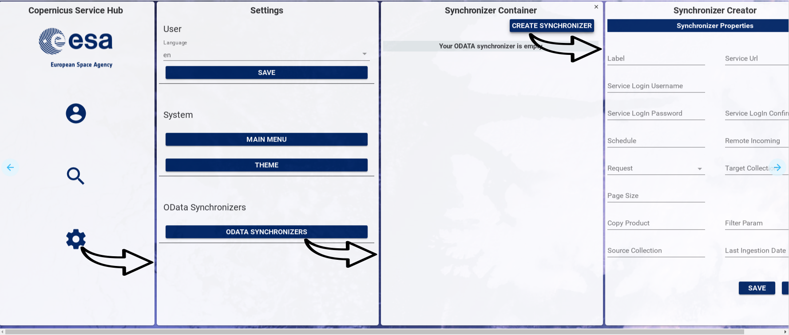

# OWC Software Architecture

## Web Component architecture
### Introduction
*OWC* is based on web components standard, using Google's Polymer library.
Each entity in *OWC* is a web component, following the Model View Controller (MVC) design pattern and compatible with JavaScript ECMAScript 5 and ECMAScript 6.

### A basic Polymer component
The basic Polymer component is an extension of HTML tags, where the root element contains component name.
A minimum set of tags is used to define:
- component view (HTML and CSS)
- component controller (JavaScript)  

Below is reported an example of a new component with name *new_component* written following ECMAScript 6 standard.

```
<dom-module id="new-component">

<template>
  <style>
    h1{
      font-size:33px;
    }
  </style>
  <h1>New Component title</h1>
</template>

<script>
    (function() {
       'use strict';
       class NewComponent {
           beforeRegister() {
               this.is = 'new-component';
           }
       };
      Polymer(NewComponent);

    })();
  </script>

</dom-module>
```
The code snippet is detailed in the next paragraphs.

#### dom-module
The **dom-module** is the HTML tag used by Polymer to specify the web component DOM (Document Object Model), called *local DOM*.
The following code snippet is used to define a new html tag module with name *new-component*.

```
<dom-module id="new-component">
...
</dom-module>
```


#### Component View
Component view is included in  HTML &lt;template&gt; element, a mechanism for holding client-side content that is not to be rendered when a page is loaded but may subsequently be instantiated during runtime using JavaScript.
The template tag contains HTML tags and CSS style definition.
Below is reported a code snipped related to *new_component* view.

 ```
 <template>
   <style>
     h1{
       font-size:33px;
     }
   </style>
   <h1>New Component title</h1>
 </template>
 ```

#### Component Controller

Following the Model View Controller design pattern, the controller contains the logic to glue the model with the view.
The controller gets data from the data-sources (i.e. model) and binds this data to the view.
*Polymer* supports also bidirectional data binding. For more information, please refer to [official documentation](https://www.polymer-project.org/1.0/docs/devguide/data-binding).

The controller is defined inside the &lt;script&gt; block of a Web Component, as indicated in the code below.

```
  <script>
    (function() {
       'use strict';
       class NewComponent {
           beforeRegister() {
               this.is = 'new-component';
           }
       };
      Polymer(NewComponent);

    })();
  </script>
```

*OWC* is developed using ES6 ([ECMAScript 6](https://en.wikipedia.org/wiki/ECMAScript) standard). The approach to follow using ES6 with Polymer is detailed in [Polymer's official blog post](https://www.polymer-project.org/1.0/blog/es6).

With regard to example above, the controller is implemented within a Javascript class, named *NewComponent*.
This class includes, if needed, implementation of the main callbacks of Polymer used to handle Polymer elements lifecycle.
These methods are:

- **beforeRegister**: Called before creating an element and used mainly to define element properties.
- **created**: Called when the element has been created, but before property values are set and local DOM is initialized.
- **ready**: Called after property values are set and local DOM is initialized.
- **attached**: 	Called after the element is attached to the document.
- **detached**: Called after the element is detached from the document.

For a complete description of Polymer callback, we suggest to read the [official documentation](https://www.polymer-project.org/1.0/docs/devguide/registering-elements) about Polymer Compoents lifecycle.

The code line ```Polymer(NewComponent);``` (reported in the previous code snippet) registers the new component class as new Polymer object.  The new component is usable as HTML tag after executing this statement.


### <a name="mbstructure0001"></a>Web component folder structure
*OWC* web components folder structure is inspired from Google's official web components folder structure.

```
├── bower.json
├── demo
│   └── index.html
├── index.html
├── package.json
├── README.md
├── new-component.html
├── test
│   ├── index.html
│   └── new-component.html
├── wct.conf.js
└── wct.conf.json
```
Main files contained in the web component are:
 -  **bower.json**:
 this file contains the third part dependencies, downloadable via [Bower](https://bower.io/). To install locally component's dependecies, you have to run ```bower install``` command on a terminal.
 -  **demo** folder, which contains the file *index.html*, with HTML code used for component demonstration page.
 - **index.html**:
  this file contains the code to autogenerate the Polymer component documentations and demo.
 - **package.json**:
  this file contains the Nodejs and npm dependencies. To install locally component's dependecies, you have to run ```npm install``` command on a terminal.
 - **README.md**, i.e.
  Markdown documentation of component, containing typically a high level and  short description of component's functionalities.
 - **new-component.html**:
 this file contains the source code of the web component.
 - **test** folder, which contains the following files:
  - **index.html**,including instruction to exploit the [web component tester](https://github.com/Polymer/web-component-tester) used for web component unit tests
  - **new-component.html**, containing the implementation of unit tests for the *new-component*
 - **wct.conf.js**: in this file are listed  [web component tester](https://github.com/Polymer/web-component-tester) module settings
 - **wct.conf.json**: this file includes
[web component tester](https://github.com/Polymer/web-component-tester) module configuration


## OWC main components
### navigation-manager component
#### Architecture
This component manages the currently displayed components using the navigation stack, which is represented by an array of components. The first element in the array is the root, the **dynamic-main-menu**. The last element in the array is the last component displayed at the right of the screen (in Desktop view). The user can add components to the stack using the method **pushComponent** of navigation manager and can remove all components from the navigation stack, except for the root element, using the **popComponent** method. In Desktop view the new component is pushed on the right of the last visualized component, while in Mobile view the new component is pushed up to the currently visualized component.



#### Usage
*navigation-manager* web component is part of *owc-app* web component, included in OWC application.

Here is an example on how to get a reference to *owc-app* web component in a different web component:

``` javascript
this.owcApp = document.querySelector('#owc-app');
```
The navigation-mamager is mainly used to publish a new panel in the DOM, by means of pushComponent method, which has the following input parameters:
- **component**, i.e. component name
- **panelWidth**, i.e. width in pixel of container panel
- **title**, i.e. panel title
- **hideCloseButton**, i.e. a boolean used to show or hide close button in panel
- **resizable**, i.e. a boolean used to enable or disable panel resizing
- **maxInstances**, i.e. the maximun number of component instances shown at a time  

``` javascript
pushComponent(component, panelWidth, title, hideCloseButton, resizable, maxInstances){
  ...
  ...
}
```

Below is reported an axample of navigation-manager component usage:
- HTML code

```html
<paper-icon-button icon="visibility"
on-click="details" title="View Product Details"></paper-icon-button>
```

- Javascript code


```javascript
details(){
var product = document.createElement('product-details');
this.navigationManager.pushComponent(product, '500px', 'Product Details');
}
```


### message-broker component
The communication among web components is managed by the Message Broker, a centralized messaging system based on the publish-subscribe Design Pattern.

#### Architecture
In software architecture, publish–subscribe is a messaging pattern involving 2 main actors: publishers and subscribers.

**Publishers** are senders of messages. They don't send messages to specific receivers, but define messages into classes, regardless of whether there are or not receivers (so called subscribers).

**Subscribers** are messages receivers. They don't know who are message senders (so called publishers), but they express interest in one or more classes and only receive messages that are of interest for them.


This component exposed 3 main interfaces:
- subscribe, which is used by subscribers to express interest in one or more classes containing message definition;
- unsubscribe, which is used by subscribers to express ended interest in one or more classes containing message definition;
- publish, which is used by publishers to send notifications about one or more message classes.

#### <a name="mbusage0001"></a> Usage

*message-broker* web component is part of *owc-app* web component, which is included in OWC application.

Here is an example on how to get a reference to *owc-app* web component in a different web component:

``` javascript
this.owcApp = document.querySelector('#owc-app');
```

##### Publish method usage

A possible use case of **publish** method is to notify when a new model from server is ready to be used by components that need that model.

In this case the component acting as *publisher* uses the **publish** method in the following way:

``` javascript
this.owcApp.messageBroker.publish(topic,model,target);
```
where:
- **topic** is a string representing topic name (i.e. message class name);
- **model** is the variable containing the updated model;
- **target** is the recipient component of the notification. If target is not specified, the notification impacts all components which expressed interest in the class containing message definition

Here is an example of usage:

``` javascript
this.owcApp.messageBroker.publish('setNewModel',this.model,this.target);
```
##### Subscribe method usage

A possible use case of **subscribe** method is to perform action after a reception of a notification of model update.

In this case the component acting as *subscriber* uses the **subscribe** method in the following way:

``` javascript
this.owcApp.messageBroker.subscribe(topic,
  function(model){
  ....
},target);
```
where:
- **topic** is a string representing topic name (i.e. message class name);
- **model** is the variable containing the updated model;
- **target** is the recipient component of the notification. If target is not specified, the notification impacts all components which expressed interest in the class containing message definition

Here is an example of usage:

``` javascript
this.owcApp.messageBroker.subscribe('setNewModel',
  function(model){
  this.model=model;
},this.target);
```

##### Unsubscribe method usage

A possible use case of **unsubscribe** method is to cease reception of a notification of model update.

In this case the component acting as *subscriber* uses the **unsubscribe** method in the following way:

``` javascript
this.owcApp.messageBroker.unsubscribe(topic);
```
where  **topic** is a string representing topic name (i.e. message class name)

Here is an example of usage:

``` javascript
this.owcApp.messageBroker.unsubscribe('setNewModel');
```

### toast-manager component
Toast manager component is devoted to show notification to users, as labels displayed on bottom of screen. Currently this web component manages the following notification types:
- **info**, used to notify information messages, like login-in or log-out operation result;
- **warn**, used to notify warning messages, like operations not supported.


#### Usage

*toast-manager* web component is part of *owc-app* web component, which is included in OWC application.

An example on how to get a reference to *owc-app* web component can be found at the following [link](#mbusage0001).

Information messages can be displayed on the screen by means of the following syntax:
``` javascript
  this.owcApp.toastManager.info(message);
```

where *message* is the string containing text to be shown.

Here is an example of usage:

``` javascript
this.owcApp.toastManager.info('Completed new search.');
```


Warning messages can be displayed on the screen by means of the following syntax:
``` javascript
  this.owcApp.toastManager.warn(message);
```

where *message* is the string containing text to be shown.

Here is an example of usage:

``` javascript
this.owcApp.toastManager.warn('Product Type Not Supported');
```


### semantic-manager component
The Open Web Components (OWC) is composed by a generic set of components used for disseminating data regardless of their types.
Ingested Objects in the DHuS have a specific class type, for every class type the UI components (e.g. List, Map) need to extract a set of attributes from the server model. This means that  OWC software needs to  know the semantic of the server model. To avoid hardcoded semantic in components code, OWC uses a generic model containing proper attributes for each different item, exploiting a Semantic Schema from Server.

The *Semantic Manager* generates the generic model extracting the data from the Search Request Model and applying the mapping defined in the Semantic Schema.

#### Architecture


### Metadata Processor (client side plugin system)

OWC Metadata Processor is a system to manage user's plugins to process metadata from searches, and to create automatic tasks client side.

In other words Metadata processor is the plugin system client base, to script in javascript language, directly via browser without setup the development environment on the local machine.

This means a simple processing environment of data from server without to rebuild or interact with the server.


- **Datasource**: DHuS search
- **Processor**: Parallel task runner
- **Data Visualizer**: Data visualization component


The data source module provides the data from the server (e.g. the search result model) to the processor. The Processor runs sequentially the threads of the plugin, passing as first input the model from the datasource, and then, it passes the output of the previous thread as input of the  next thread. The outcome of the last thread is the result of the plugin. The outcome of the plugin represents the model of the visualizer component of the plugin (GUI part).


So a specific plugin is composed with:
- Main model input
- A set of threads, the sequence of tasks to run
- Visualizer component, data visualization component to show the outcome from the last thread of plugin


#### Architecture
The definition of a specific plugin is contained in the configuration file e.g.:

```
"processor_plugins": [{
    "name": "Products size average",
    "visualizer": "average-visualizer",
    "webworkers": ["processor-plugins/search.js","processor-plugins/001.js"]
}]
```
 - **name**: Plugin name, to show in the the plugin selector.
 - **visualizer**: Web component to show the plugin outcome.
 - **webworkers**: array with the urls of threads implemented as web-workers.

##### Web worker
Web workers are the thread functionality implementation for browser based javascript.
The execution is parallel.
[Web Workers on wikipedia](https://en.wikipedia.org/wiki/Web_worker)

 And example of a web workers follows (from wikipedia):

```
  var n = 4;
  postMessage(n);
}
```
